# Markdown Links

## Índice

* [1. Preámbulo](#1-preámbulo)
* [2. Resumen del proyecto](#2-resumen-del-proyecto)
* [3. Diagrama de Flujo del Proyecto](#3-diagrama-de-flujo-del-proyecto)
* [4. Planificación Github Project](#4-planificación-github-project)
* [5. Modo de uso API](#5-Modo-de-uso-API)
* [6. Modo de uso Interfaz de Linea de Comandos CLI](#5-Modo-de-uso-interfaz-de-línea-de-comandos-CLI)
* [7. Test Unitarios](#6-test-unitarios)
* [8. Guía de Instalación](#7-guía-de-instalación)
* [9. Checklist](#8-checklist)

***

## 1. Preámbulo

En este cuarto proyecto se ha creado una herramienta de línea de comando (CLI) al igual que mi propia librería en JavaScript. Se ha creado una herramienta usando Node para que lea y analice archivos en formatos `Markdown`, para así verificar que diversos links contengan y se reporten algunas estadísticas. 

## 2. Resumen del proyecto

En este proyecto se ha construido un programa que será ejecutado en la terminal o consola. La forma en la que se usará esta aplicación es mediante comandos diseñados y programados por mí mediante la misma shell de trabajo. 

Diversos comandos nos daran ingreso a links en archivos/directorios, total de links, unique y broken.

## 3. Diagrama de Flujo del Proyecto

Para organizar los pasos a seguir, planificar tareas y objetivos en relación al código, se crearon dos diagramas de flujo.

- Diagrama de Flujo de la API

- Diagrama de Flujo del CLI

## 4. Planificación Github Project

Para realizar este proyecto se contaba con 4 sprints en los cuales se fueron desarrollando diferentes objetivos de acuerdo a la planicación inicial. 

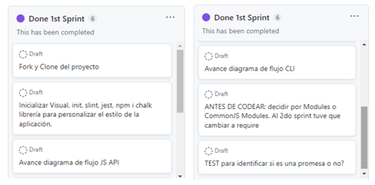

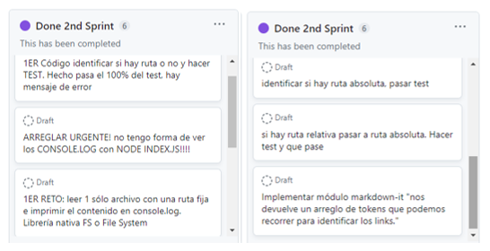

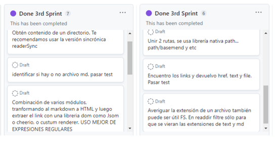

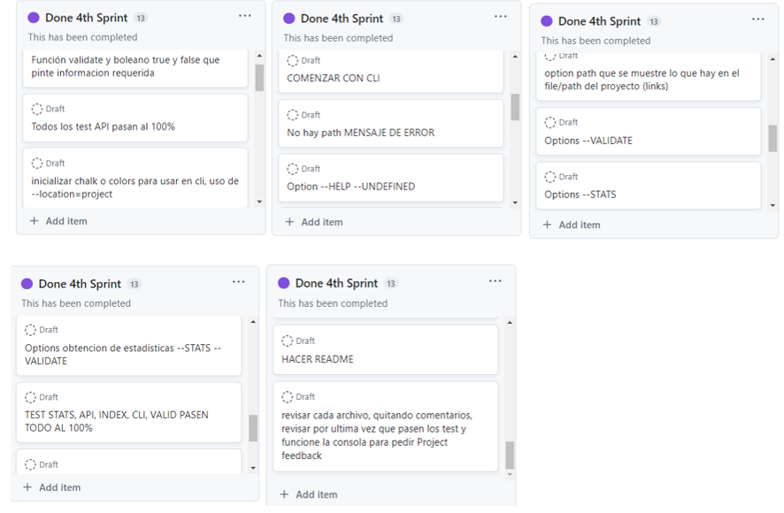

## 5. Modo de uso "API"

Este proyecto consta de dos partes: API Y CLI.

**1) JavaScript API**
Esta es una funcion lógica la cual retorna una promesa mdLinks(filePath, options). Esta recibe dos parámetros siendo filePath una ruta absoluta o relativa, mientras que options ({validate: true} ó {valite: false}) nos retorna un array de objetos de cada link encontrado en nuestro archivo. 

**Valores de retorno**
Con `validate:false`:

* `href`: URL encontrada.
* `text`: Texto que aparecía dentro del link (`<a>`).
* `file`: Ruta del archivo donde se encontró el link.

Con `validate:true`:

* `href`: URL encontrada.
* `text`: Texto que aparecía dentro del link (`<a>`).
* `file`: Ruta del archivo donde se encontró el link.
* `status`: Código de respuesta HTTP.
* `ok`: Mensaje `fail` en caso de fallo u `ok` en caso de éxito.

## 6. Modo de uso "Interfaz de Línea de Comando (CLI)"

Este ejecutable debe poder usarse a través de la consola o terminal. 

1. Si se usa **md-links** nos entrega un comando que nos dará la bienvenida:
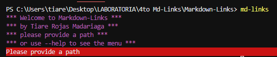

2. Si se usa **md-links --help** nos entregará el menu del programa:
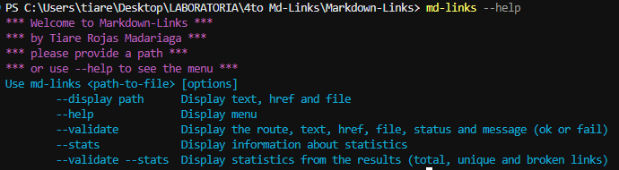

3. Si se usa **md-links <path> --display path** nos entregará una lista de los links del archivo o directorio que necesitamos revisar:
  
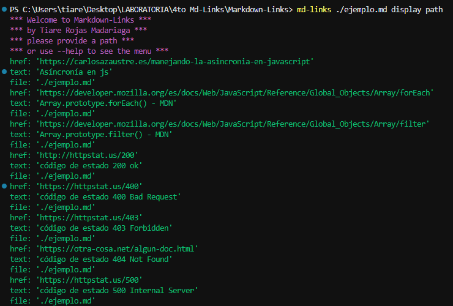

4. Si se usa **md-links <path> --validate** el módulo hará una petición HTTP para averiguar si los links funcionan o no. Nos debe dar la href, text, file, status y mensaje OK o FAIL. 
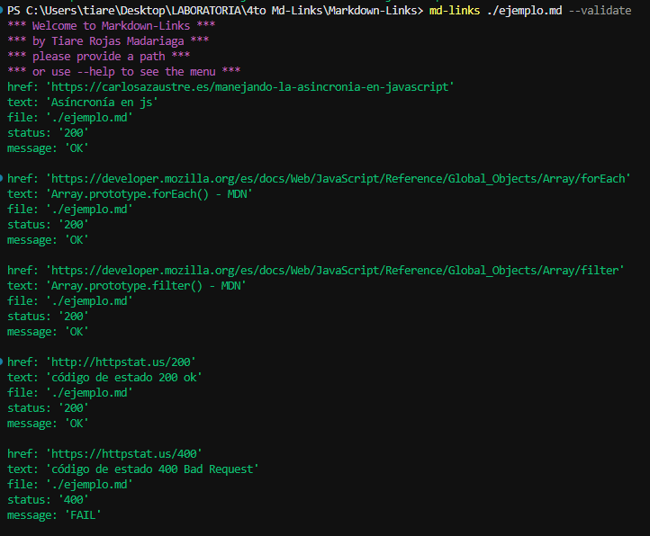
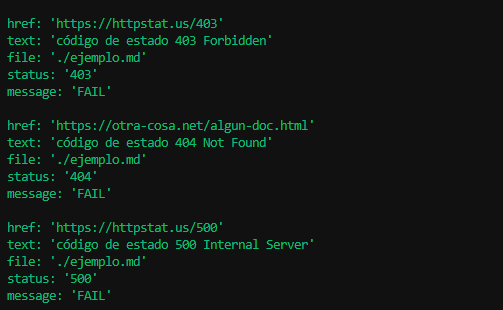

5. Si se usa **md-links <path> --stats** nos entregará un texto con estadísticas básicas sobre los links:
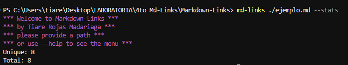

6. Si se usa **md-links <path> --validate --stats** nos mostrará estadísticas que también necesiten de los resultados de validación:
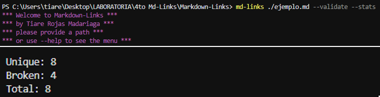

## 7. Test Unitarios

Se realizaron 8 test unitarios para cada una de las funciones de la API, como los otros archivos .js del proyecto.
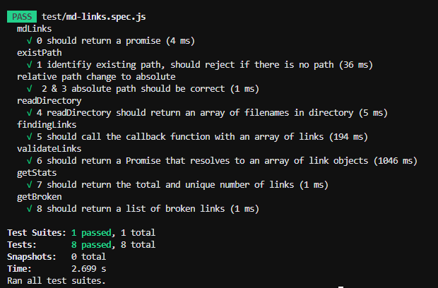

## 8. Guía de Instalación

Para instalar esta librería se debe hacer de la siguiente manera: 

- de forma global: **npm install -g md-links**,
- de forma local: **npm install md-links --location=project**,
- para que todas sus dependiencias funcionen correctamente como tercer paso se debe escribir en consola **npm install**,
- para correr los test se debe usar **npm run test** o **npm test**.

## 9. Checklist

### General

* [x] Puede instalarse via `npm install --global <github-user>/md-links`

### `README.md`

* [x] Un board con el backlog para la implementación de la librería.
* [x] Documentación técnica de la librería.
* [x] Guía de uso e instalación de la librería

### API `mdLinks(path, opts)`

* [x] El módulo exporta una función con la interfaz (API) esperada.
* [x] Implementa soporte para archivo individual
* [x] Implementa soporte para directorios
* [x] Implementa `options.validate`

### CLI

* [x] Expone ejecutable `md-links` en el path (configurado en `package.json`)
* [x] Se ejecuta sin errores / output esperado
* [x] Implementa `--validate`
* [x] Implementa `--stats`

### Pruebas / tests

* [x] Pruebas unitarias cubren un mínimo del 70% de statements, functions,
  lines, y branches.
* [x] Pasa tests (y linters) (`npm test`).
